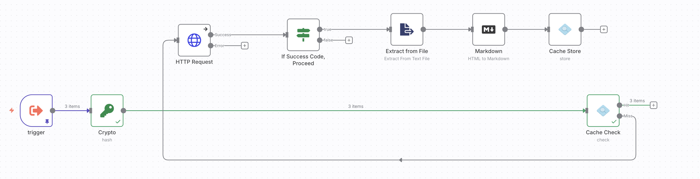
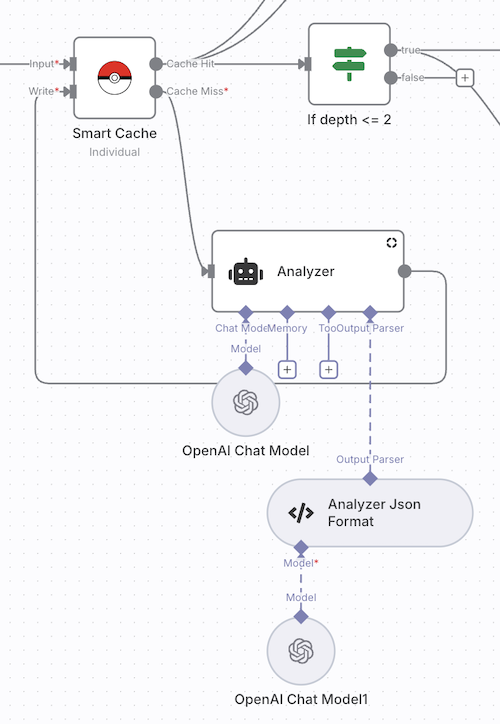

# n8n-nodes-s3cache

`n8n-nodes-s3cache` is an n8n community node that turns Amazon S3 (or S3-compatible storage) into a flexible cache for your workflows. It adds two actions—**Store** and **Check**—to help you persist intermediate data, avoid expensive API calls, and fan workflows across the `Hit`/`Miss` outputs.

Unlike traditional cache nodes, this package keeps the node "transparent": Cache Store passes its input straight through after writing to S3, and Cache Check only emits cached content when it finds a fresh entry, otherwise forwarding the original item down the miss branch.



The node ships as two discrete actions for a few reasons:

1. A pair of simple nodes is easier to reason about in large workflows.
2. Complex branching logic often needs miss traffic to loop back into different branches without disturbing other inputs.
3. Combined cache implementations can mangle n8n’s `itemIndex` when multiple inputs merge—splitting Store/Check keeps indices consistent.  
   

[Installation](#installation) •
[Operations](#operations) •
[Credentials](#credentials) •
[Usage](#usage) •
[Resources](#resources) •
[Version history](#version-history)

---

## Installation

1. Open your self-hosted n8n instance.
2. Navigate to **Settings → Community Nodes → Install**.
3. Enter the package name `n8n-nodes-s3cache` and confirm.
4. Restart n8n if prompted so the node bundle loads correctly.

> ℹ️ Community nodes aren’t available on n8n Cloud. Install them on self-hosted or desktop builds only.

---

## Operations

| Operation    | Description                                                                                                      | Outputs        |
|--------------|------------------------------------------------------------------------------------------------------------------|----------------|
| Cache Store  | Writes either JSON or a chosen binary property to the configured S3 bucket/folder, tagging objects with TTL info | `Hit` (pass-through) |
| Cache Check  | Looks up the object by Cache ID, validates TTL, and emits cached payloads (JSON/binary) or routes to miss output | `Hit` (cached data), `Miss` (original input) |

- Cache IDs map directly to object keys (optionally under a folder/prefix from the credentials).
- TTL is stored as metadata and compared against the object’s last-modified timestamp.

---

## Credentials

Create a single **S3 Credentials** entry (ships with this package) that holds:

| Field              | Notes                                                                 |
|--------------------|-----------------------------------------------------------------------|
| Access Key ID      | IAM user access key or equivalent                                     |
| Secret Access Key  | Matching secret key (stored as password field)                       |
| S3 Region          | Region for your bucket (defaults to `us-east-1`)                     |
| S3 Bucket Name     | Bucket where cache entries will live                                  |
| Folder Name        | Optional prefix/folder (omit leading/trailing slashes)               |
| Force Path-Style   | Enable for buckets with dots or custom S3-compatible endpoints       |

The node signs requests with AWS Signature Version 4 using these credentials, so any S3-compatible provider that supports SigV4 should work (AWS S3, MinIO, Cloudflare R2, etc.).

### Recommended IAM Policy

Grant the IAM user only the permissions the cache needs. Replace `<insert bucketname here>` with your bucket name, then attach the following policy (adapted from [AWS S3 policy docs](https://docs.aws.amazon.com/AmazonS3/latest/userguide/example-policies-s3.html)):

```json
{
	"Version": "2012-10-17",
	"Statement": [
		{
			"Sid": "SeeAllBucketsInUI",
			"Effect": "Allow",
			"Action": "s3:ListAllMyBuckets",
			"Resource": "*"
		},
		{
			"Sid": "BucketMetadataAndSearch",
			"Effect": "Allow",
			"Action": [
				"s3:GetBucketLocation",
				"s3:ListBucket",
				"s3:ListBucketVersions",
				"s3:ListBucketMultipartUploads"
			],
			"Resource": "arn:aws:s3:::<insert bucketname here>"
		},
		{
			"Sid": "ObjectReadWriteAndTags",
			"Effect": "Allow",
			"Action": [
				"s3:GetObject",
				"s3:GetObjectVersion",
				"s3:GetObjectAttributes",
				"s3:GetObjectTagging",
				"s3:PutObject",
				"s3:PutObjectTagging",
				"s3:DeleteObject",
				"s3:DeleteObjectVersion",
				"s3:RestoreObject"
			],
			"Resource": "arn:aws:s3:::<insert bucketname here>/*"
		},
		{
			"Sid": "MultipartHelpers",
			"Effect": "Allow",
			"Action": [
				"s3:ListMultipartUploadParts",
				"s3:AbortMultipartUpload"
			],
			"Resource": "arn:aws:s3:::<insert bucketname here>/*"
		}
	]
}
```

---

## Usage

1. **Store**: Drop the node after an expensive step, set Cache ID (e.g., from an item field), pick JSON or Binary payload, and optionally adjust TTL. The node writes to S3 and forwards the original data to the next node.
2. **Check**: Place this before the expensive step. Use the same Cache ID. Wire output `0` (Hit) to the downstream logic that consumes cached data, and output `1` (Miss) back into the expensive branch to recompute and store.
3. To cache binary data, select `Binary` and provide the property name (default `data`). Cache Check will restore the binary with the same property name and MIME type metadata.

Tips:
- Use deterministic IDs (hashes, concatenated parameters) so repeated inputs hit the same key.
- Combine with IF/Switch nodes to merge hit/miss branches if needed.
- TTL enforcement requires the S3 `Last-Modified` header; if it’s missing or stale the node automatically routes to the miss output.

---

## Testing

1. Run `npm run build` to refresh the compiled `dist` bundle so tests can import the latest helpers.
2. Execute `npm test` to run the lightweight Node test suite (no extra dependencies required). The suite covers path canonicalization, response buffering, and TTL freshness checks so regressions in those areas are caught early.
3. (Optional) Import the sample workflow from [`examples/cache-demo.workflow.json`](examples/cache-demo.workflow.json) into n8n. Set your S3 credentials on the Store/Check nodes, then run the workflow twice:
   - Run 1: You should see the miss branch populate and store the computed payload.
   - Run 2: The hit branch should fire immediately, proving the cache is being used.

> Tip: the example workflow mirrors the recommended production pattern—Check node upfront, miss branch recomputes data and passes through the Store node before rejoining the main path.

---

## Resources

- [n8n Community Nodes documentation](https://docs.n8n.io/integrations/community-nodes/installation/)
- [Amazon S3 REST API reference](https://docs.aws.amazon.com/AmazonS3/latest/API/Welcome.html)
- [Project repository](https://github.com/gaweee/n8n-nodes-s3cache)

---

## Version history

| Version | Highlights                                                                                               |
|---------|----------------------------------------------------------------------------------------------------------|
| 0.2.0   | Single S3 node with Cache Check/Store actions, dual outputs, SigV4 signing, JSON/Binary payload support. |
| 0.1.x   | Initial credential scaffolding and basic Cache Store prototype.                                          |
